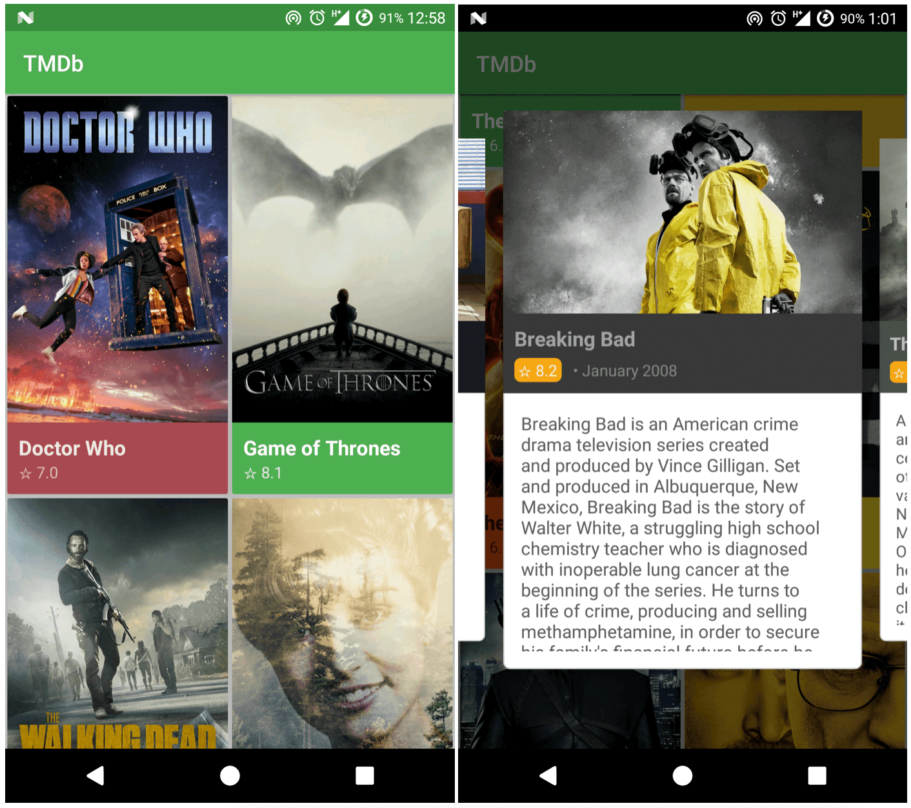
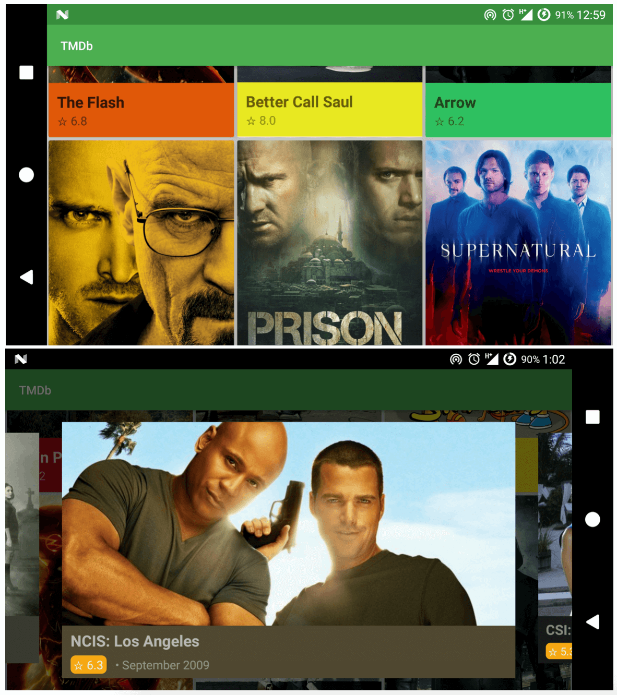

# README #

### Major Techonogies/Libraries used ###

* MVP
* [Retrofit2](https://github.com/square/retrofit)
* [RxJava](https://github.com/ReactiveX/RxAndroid)
* [Dagger2](https://github.com/google/dagger)
* [ButterKnife](https://github.com/JakeWharton/butterknife)
* [Glide](https://github.com/bumptech/glide)
* [Parceler](github.com/johncarl81/parceler)
* [Dart](https://github.com/f2prateek/dart)

### Preview ###

